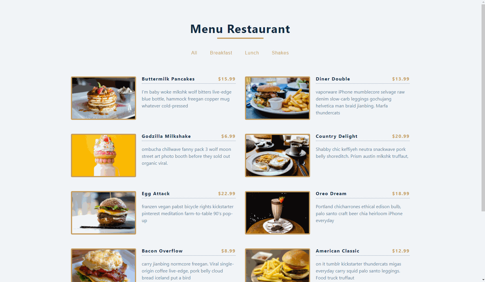

<h1 align="center">
  Menu Restaurant
</h1> 

## 💻 Project

 - Learning ReactJS;
 - Menu filter based on each item category;
 - Dynamic selection button, based on an array of unique values (ES6).
 

&nbsp;&nbsp;

---

## 🔥 Check it out!
 

- [https://menu-restaurant-app.netlify.app/](https://menu-restaurant-app.netlify.app/)

  

&nbsp;&nbsp;

